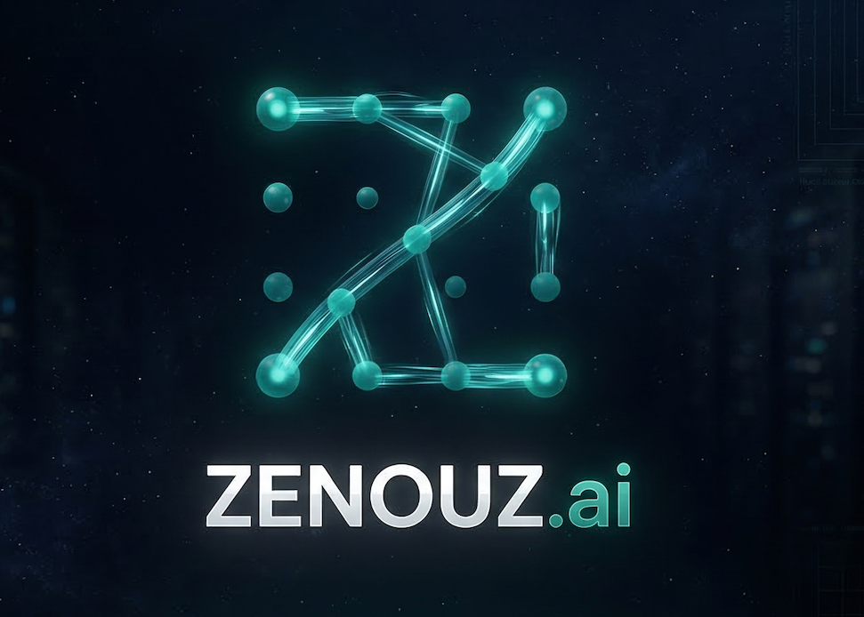

<h1 align="center">ZENOUZ&nbsp;.ai</h1>

  

  

  
  

---

### 👋 What this is

**ZENOUZ.ai** is Kayvan Zenouz's public AI lab for agentic systems, applied research, and product experiments that make people **more capable, curious, and in control**. The work is ambitious by design, but the rule is simple: let AI reason, never let it decide what matters unchecked.

### 🚀 Featured projects

<table>
  <tr>
    <td width="50%" valign="top">
      
      <h3><a href="https://zenouz.ai/projects/zeninvest/">ZenInvest</a></h3>
      
<strong>Autonomous, multi-LLM investment committee where Claude leads strategy, GPT-4o plays skeptic, and Gemini scores risk before any trade. Deterministic Python owns every safety-critical control.</strong>

      
<em>~62K LOC · 1,341 passing tests · Dockerized on a VPS.</em>

      
Built around inspectable debate, hard risk vetoes, drawdown and position limits, operator visibility, and a clear separation between model reasoning and deterministic control.

      
Research proof-of-concept; not financial advice.

    </td>
    <td width="50%" valign="top">
      
      <h3><a href="https://zenouz.ai/projects/zengrowth/">ZenGrowth</a></h3>
      
<strong>Evaluation-driven career operating system using RAG, GraphRAG, and LLM-as-judge to score senior roles and write evidence-grounded applications with traceable truth paths.</strong>

      
Built for senior AI and data-science searches: discover roles, score fit, draft tailored materials, and keep every generated claim tied back to verified evidence.

      
Early beta; generated applications are drafts for human review.

    </td>
  </tr>
</table>

### 🧠 How we build

- **Agentic, but inspectable** — specialist agents can reason, debate, retrieve, and critique; deterministic systems keep authority over consequential decisions.
- **Human-in-control** — autonomy is useful only when the operator can pause it, inspect it, and override it.
- **Evidence over vibes** — claims are grounded, evaluated, and gated before they become user-facing output.
- **Built in public** — architecture, trade-offs, safety posture, and product direction are exposed for scrutiny.

### 🔬 In the lab

ZenInvest and ZenGrowth are the public edge of a broader research track: governed memory, agentic forecasting, pricing and risk, simulation-first robotics, and practical evaluation systems for AI products.

### 🧭 Explore

- 🌐 **[zenouz.ai](https://zenouz.ai)** — the platform
- 🧩 **[Projects](https://zenouz.ai/projects/)** · ✍️ **[Writing](https://zenouz.ai/writing/)** · 👤 **[About](https://zenouz.ai/about/)**
- 💼 The person behind it: **[Kayvan Zenouz](https://linkedin.com/in/kayvan-zenouz)** — AI & Data Science Lead, PhD in Mathematics

---

<i>Building AI that makes humans more capable, curious, and in control.</i>

