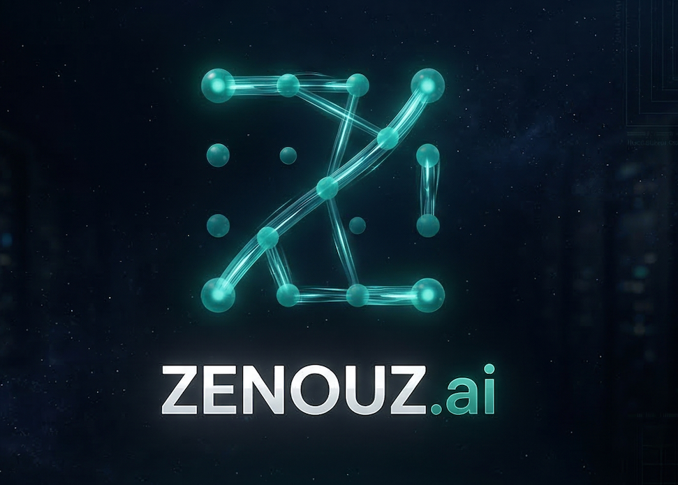
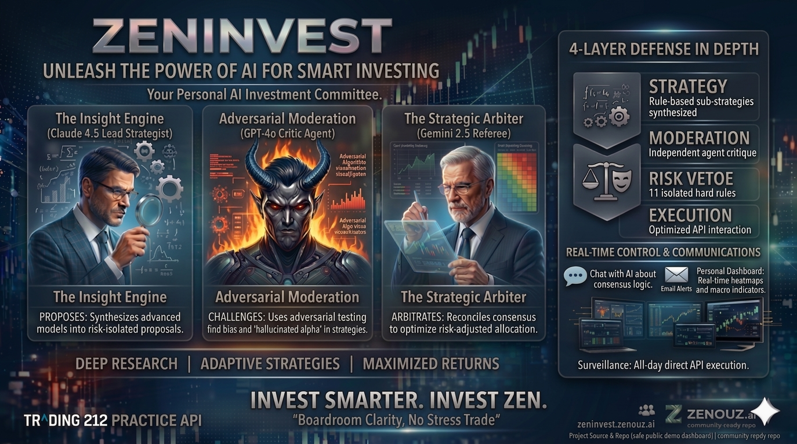
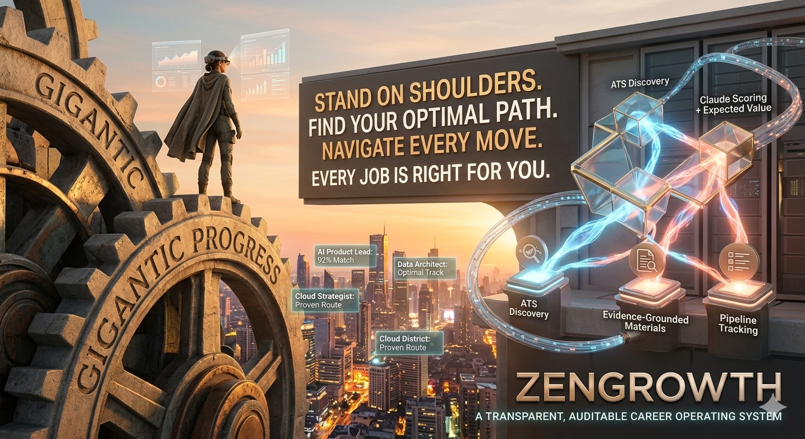

  

<h1 align="center">Inspectable AI systems with accountable control</h1>

  Applied research and open-source products by Kayvan Zenouz. 
  Built to keep people capable, curious, and in control.

  
  

## Purpose

ZENOUZ.ai is a public AI lab for agentic systems, applied research, and product
experiments. Models can research, reason, and explain, while deterministic
software and human review retain authority over consequential decisions.

Work spans energy, utilities, financial services, robotics, and education.

## How the systems are built

- **Inspectable:** reasoning, evidence, costs, and state changes remain reviewable
- **Human-controlled:** operators can pause, correct, approve, or reject external action
- **Deterministic at the boundary:** code, not model confidence, enforces hard constraints
- **Evidence-led:** evaluations and failure cases matter more than activity or marketing metrics

## Portfolio map

  
  
  
  

The same control pattern appears across investing, career workflows, forecasting,
pricing, governed memory, and simulation-first robotics. Each project changes the
domain while keeping authority, evidence, and failure handling explicit.

## Open-source systems

### [ZenInvest](https://github.com/zenouz-ai/zeninvest)

An agentic investment research and paper-trading system where distinct strategy,
challenge, and risk roles examine each proposal. Evidence-backed debate remains
separate from deterministic code that owns capital constraints, execution, and
the final trading veto.

**Pattern:** multi-vendor reasoning · deterministic risk controls · evidence-gated learning 
**Explore:** [repository](https://github.com/zenouz-ai/zeninvest) · [project brief](https://zenouz.ai/projects/zeninvest/)

Research proof of concept. Not financial advice.

### [ZenGrowth](https://github.com/zenouz-ai/zengrowth)

A local-first career operating system for role discovery, evidence-grounded
applications, interviews, offers, and later career transitions. Grounding gates
block unsupported claims, while audit trails and human approval keep external
actions under operator control.

**Pattern:** verified evidence · explainable ranking · human-controlled workflow 
**Explore:** [repository](https://github.com/zenouz-ai/zengrowth) · [project brief](https://zenouz.ai/projects/zengrowth/)

Working system under prospective evaluation. Generated materials require human review.

## Research track

  
  
  
  
  

- **[ZenArena](https://zenouz.ai/writing/zenarena-governed-memory/):** tests whether a frozen model improves through governed memory alone
- **[ZenForecast](https://zenouz.ai/writing/zenforecast-agentic-forecasting/):** combines probabilistic forecasts with leakage-resistant evaluation and an append-only record
- **[ZenRate](https://zenouz.ai/writing/zenrate-agentic-pricing/):** keeps deterministic pricing maths separate from agent advice, explanation, and audit
- **[ZenLab](https://zenouz.ai/writing/zenlab-agentic-sandbox/):** qualifies agentic techniques through small, reproducible experiments and promotion gates
- **[Stitch](https://zenouz.ai/writing/stitch-digital-twin/):** tests a wildlife-safe canal-cleaning robot in simulation before hardware spend

Explore the [project index](https://zenouz.ai/projects/) and
[research writing](https://zenouz.ai/writing/) for architecture, evidence, and caveats.

> **Independent work.** ZENOUZ.ai is personal, non-commercial research and
> development, separate from professional employment. It is shared for research
> and demonstration.

---

<i>Building AI that makes humans more capable, curious, and in control.</i>

